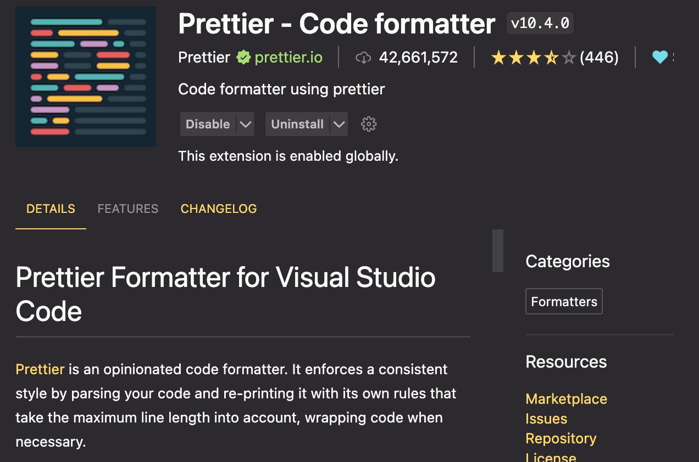
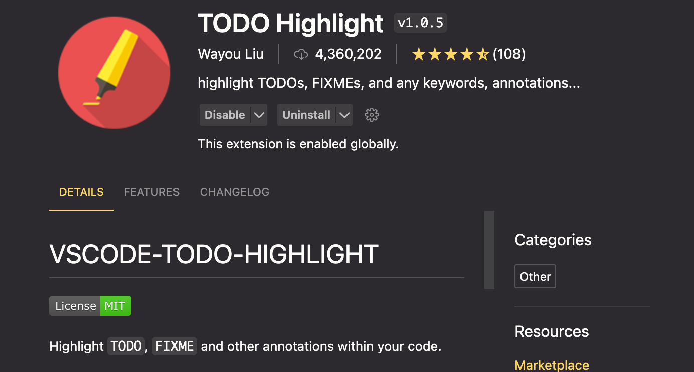
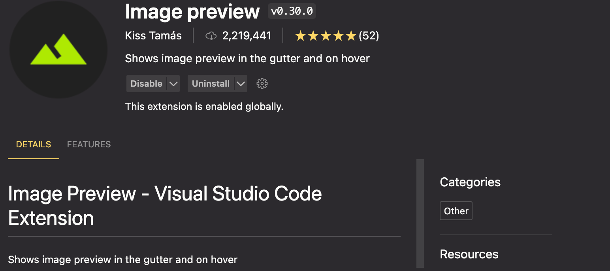

## 插件

### Prettier



设置 Default Formatter 为 Prettier，打开 Format On Save.

Prettier 的配置文件名为`.prettierrc`, 在你的每一个项目根目录下创建该文件

配置事例：

```
{
  "singleQuote": true,
  "arrowParens": "avoid"
}

```

参考[配置文档](https://prettier.io/docs/en/configuration)。

### Todo highlight



高亮显示一些关键字，可自定义。

配置文件参考[官网](https://marketplace.visualstudio.com/items?itemName=wayou.vscode-todo-highlight)。

copy 官网的相关配置， 粘贴到 vscode 的 setting 中（json 格式）。

### Monokai Pro

Theme 插件。

### Live Server

如其名， 实施预览你的 web server。

（或者不使用 vscode 的插件， 使用 npm install live-server -g, live-server, 启动）

### Image preview



预览 HTML 中的图片，在写 html 文件的时候非常好用。

## 其他设置

### Snippets

设置-> User Snippets -> 自定义一个文件名

设置快捷键， 事例：

```
{
	"Print to console": {
		"scope": "javascript,typescript",
		"prefix": "cl",
		"body": [
			"console.log($1q);",
		],
		"description": "Log output to console"
	}
}

```

## 快捷键

### CMD + J 打开 terminal

### CMD + K Clear terminal

### Shift + Option + A 块注释

### CMD + / 行注释
