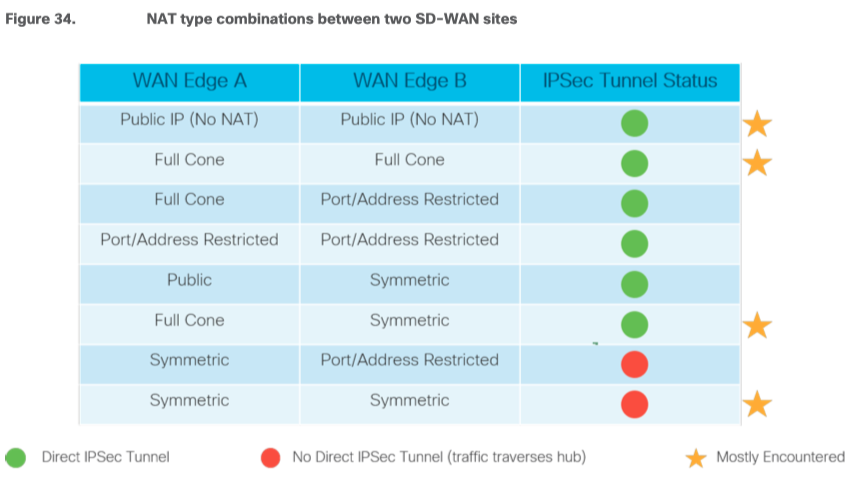

## NAT 的划分

以下是RFC3489的分类方式， 当然还有其他的分类标准，比如我们熟知的PAT就是另一种分类方式中的一种。

`RFC3489` 中将 NAT 的实现分为四大类：

- Full Cone NAT 完全锥形 NAT
- Restricted Cone NAT 限制锥形 NAT （可以理解为 IP 限制）
- Port Restricted Cone NAT 端口限制锥形 NAT （ IP+Port 限制）
- Symmetric NAT 对称 NAT

其中完全锥形的穿透性最好，而对称形的安全性最高.

## 锥形NAT与对称NAT的区别

所谓锥形NAT 是指：只要是从同一个内部地址和端口出来的包，无论目的地址是否相同，NAT 都将它转换成同一个外部地址和端口。

“同一个外部地址和端口”与“无论目的地址是否相同”形成了一个类似锥形的网络结构，也是这一名称的由来。反过来，不满足这一条件的即为对称NAT 。

**举例说明:**

NAT 内的主机 A ： IP 记为 A ，使用端口 1000
NAT 网关 ： IP 记为 NAT ，用于 NAT 的端口池假设为（ 5001-5999 ）
公网上的主机 B ： IP 记为B ，开放端口 2000
公网上的主机 C ： IP 记为C ，开放端口 3000
假设主机 A 先后访问主机 B 和 C

### 如果是锥形 NAT

那么成功连接后，状态必然如下：

```bash
A （ 1000 ） —— > NAT （ 5001 ）—— > B （ 2000 ）
A （ 1000 ） —— > NAT （ 5001 ）—— > C （ 3000 ）
```

也就是说，只要是从 A 主机的 1000 端口发出的包，经过地址转换后的源端口一定相同。

### 如果是对称形 NAT

连接后，状态有可能（注意是可能，不是一定）如下：

```bash
A （ 1000 ） —— > NAT （ 5001 ）—— > B （ 2000 ）
A （ 1000 ） —— > NAT （ 5002 ）—— > C （ 3000 ）
```

## 三种CONE NAT之间的区别

仍然以上面的网络环境为例, 假设 A 先与 B 建立了连接:

A （ 1000 ） —— > NAT （ 5001 ）——— > B （ 2000 ）

### Port Restricted Cone NAT

只有 B （ 2000 ）发往 NAT （ 5001 ）的数据包可以到达 A （ 1000 ）

```bash
B （ 2000 ） —— >  NAT （ 5001 ） ——— >   A （ 1000 ）

B （ 3000 ） —— >  NAT （ 5001 ） — X — >   A （ 1000 ）

C （ 2000 ） —— >  NAT （ 5001 ） — X — >   A （ 1000 ）
```

### Restricted Cone NAT

只要是从 B 主机发往 NAT （ 5001 ）的数据包都可以到达 A （ 1000 ）

```bash
B （ 2000 ） —— >  NAT （ 5001 ） ——— >   A （ 1000 ）

B （ 3000 ） —— >  NAT （ 5001 ） ——— >   A （ 1000 ）

C （ 2000 ） —— >  NAT （ 5001 ） — X — >   A （ 1000 ）
```

### Full Cone NAT

任意地址发往 NAT （ 5001 ）的数据包都可以到达 A （ 1000 ）

```
B （ 2000 ） —— >  NAT （ 5001 ） ——— >   A （ 1000 ）

B （ 3000 ） —— >  NAT （ 5001 ） ——— >   A （ 1000 ）

C （ 3000 ） —— >  NAT （ 5001 ） ——— >   A （ 1000 ）
```

## Cisco SDWAN NAT 建议

- 建议在数据中心或中心站点配置全锥或一对一 NAT，以便无论分支机构运行什么 NAT 类型（受限锥、端口受限锥或对称 NAT）
- 具有运行对称 NAT 的防火墙的两个站点在形成隧道连接时会遇到问题，因为此 NAT 将每一端的源端口转换为随机端口号，并且无法从外部发起流量。
- 在一个站点配置的对称 NAT 需要在另一站点上使用全锥 NAT 或没有 NAT 的公共 IP，以便在它们之间建立直接 IPsec 隧道。
- 无法直接连接的站点应设置为通过数据中心或其他集中站点相互访问。
- 请注意，对于 NAT 后面的 GRE 封装隧道，仅支持一对一 NAT。由于 GRE 数据包缺少 L4 标头，因此不支持任何类型的端口Overload的 NAT。

