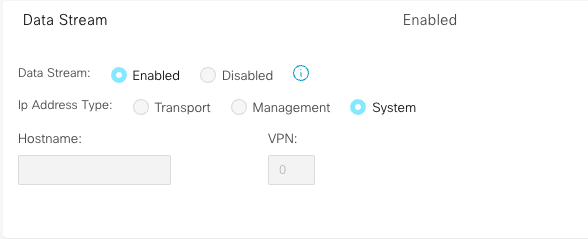
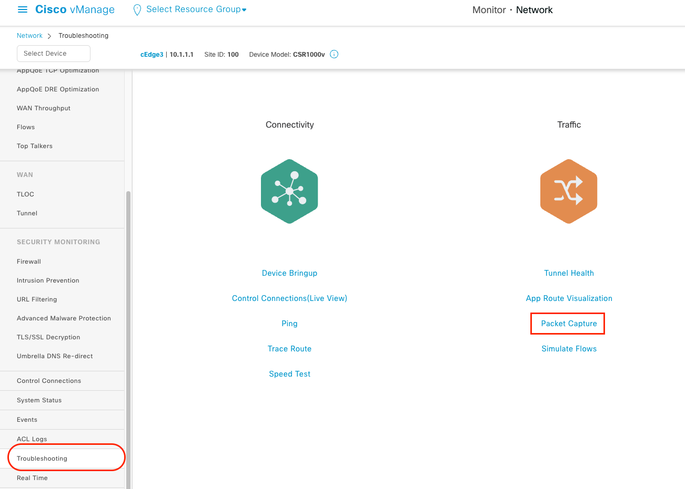
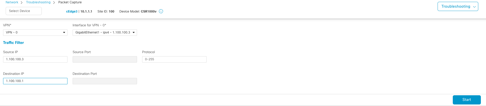
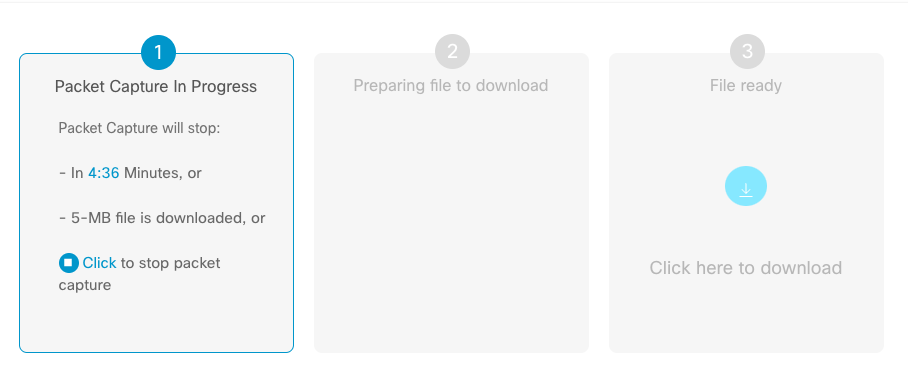
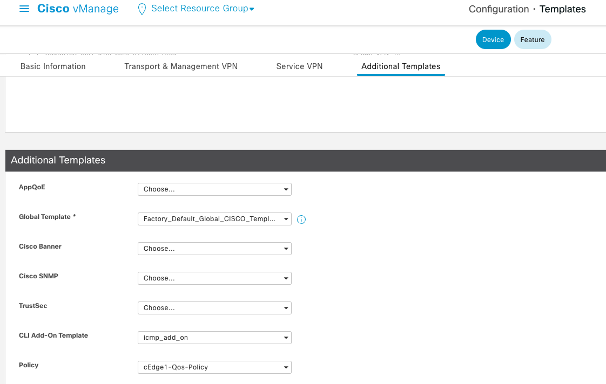
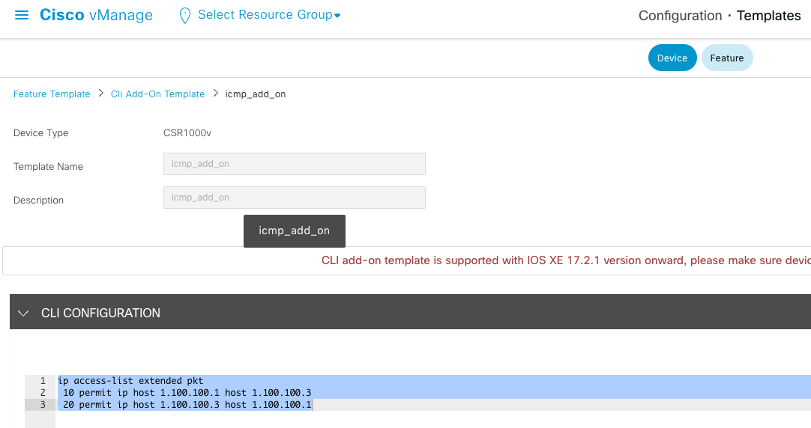

+++
title: "SDWAN环境下cEdge的抓包"
description: ""
date: 2023-10-21T04:25:12Z
lastmod: 2023-10-21T04:25:12Z
categories:
tags:
  - SDWAN
  - TS

draft: false
+++

## Embedded Packet Capture

### GUI 方式抓包

vManage 上有个很方便的抓包工具，只需要点击 Start， 就可以帮我们很方便的开启某个接口下的抓包，其本质上就是 vManage 登陆到 cEdge，下发一些 EPC 的参数。开启方法如下:

**开启 Data Stream 功能**

路径为 vManage -> Administration -> Settings -> Data Stream



**抓包路径**

开启后打开 Monitor —> Network -> cEdge -> Troubleshooting, 就可以看到 Packet Capture 的选项。



你还可以设置简单的 Traffic filter 的参数，点击 start 即可开始抓包, 测试结束后点击 Stop 按钮结束抓包， 并可以将数据包下载下来。





### 命令行方式抓包

**配置 ACL**

如果是 Cli 模式的 cEdge， 我们可以直接登陆设备进行配置对应的 ACL；如果是模版形式的 cEdge， 则需要提前使用模版将对应的 ACL 下发下去。如下, 在 Device Template 下增加一个 Cli add-on Template， 配置上你想抓取的感兴趣流。





**配置 EPC**

```bash
cEdge3#monitor  capture cap interface  gigabitEthernet 1 both access-list pkt
cEdge3#monitor capture cap buffer size  100

!!! 开启抓包

cEdge3#monitor capture cap start

!!! 执行测试

cEdge3#ping 1.100.100.1
Type escape sequence to abort.
Sending 5, 100-byte ICMP Echos to 1.100.100.1, timeout is 2 seconds:
!!!!!
Success rate is 100 percent (5/5), round-trip min/avg/max = 6/37/149 ms

!!! 停止抓包

cEdge3#monitor capture cap stop

!!! 检查抓包summary或者detial 数据

cEdge3#show monitor capture cap buffer brief
 ----------------------------------------------------------------------------
 #   size   timestamp     source             destination      dscp    protocol
 ----------------------------------------------------------------------------
   0  114    0.000000   1.100.100.3      ->  1.100.100.1      0  BE   ICMP
   1  114    0.005996   1.100.100.1      ->  1.100.100.3      0  BE   ICMP
   2  114    0.007004   1.100.100.3      ->  1.100.100.1      0  BE   ICMP
   3  114    0.011993   1.100.100.1      ->  1.100.100.3      0  BE   ICMP
   4  114    0.013000   1.100.100.3      ->  1.100.100.1      0  BE   ICMP
   5  114    0.017989   1.100.100.1      ->  1.100.100.3      0  BE   ICMP
   6  114    0.140984   1.100.100.3      ->  1.100.100.1      0  BE   ICMP
   7  114    0.166984   1.100.100.1      ->  1.100.100.3      0  BE   ICMP
   8  114    0.170981   1.100.100.3      ->  1.100.100.1      0  BE   ICMP
   9  114    0.175986   1.100.100.1      ->  1.100.100.3      0  BE   ICMP

cEdge3#show monitor capture cap buffer detailed
 ----------------------------------------------------------------------------
 #   size   timestamp     source             destination      dscp    protocol
 ----------------------------------------------------------------------------
   0  114    0.000000   1.100.100.3      ->  1.100.100.1      0  BE   ICMP
  0000:  52540017 59D25254 0018BE46 08004500   RT..Y.RT...F..E.
  0010:  00640037 0000FF01 F0950164 64030164   .d.7.......dd..d
  0020:  64010800 2038000B 00000000 00019EA2   d... 8..........
  0030:  BF63ABCD ABCDABCD ABCDABCD ABCDABCD   .c..............

!!! 或者导出pcap数据

cEdge3#monitor capture cap export bootflash:cap.pcap
Exported Successfully

!!! 测试完毕删除设置

cEdge3# no monitor capture CAP

```

## Datapath Packet Trace

Packet trace 并不是抓包， 它可以详细看到数据包经过哪些 feature，最后被丢弃还是被处理了。

```bash
debug platform condition interface GigabitEthernet xxx both << 匹配接口
Or
debug platform condition interface gigabitEthernet xxx ipv4 1.1.1.1/32 both  << 匹配接口和条目
Or
debug platform condition interface GigabitEthernet xxx ipv4 access-list pkt both  << 匹配ACL+接口

debug platform packet-trace packet 2048 fia-trace data-size 2048
debug platform packet-trace copy packet both l2 size 2048

debug platform condition start
<test>
debug platform condition stop

show platform packet-trace statistics
show platform packet-trace summary
show platform packet-trace packet all

show platform conditions
show platform packet-trace configuration
clear platform packet-trace statistics  --> clear the packet trace buffer
clear platform condition all  --> clears both platform conditions and the packet trace configuration
```

## 参考

> [Embedded Packet Capture](https://www.cisco.com/c/en/us/td/docs/ios-xml/ios/epc/configuration/xe-3s/epc-xe-3s-book.html)
