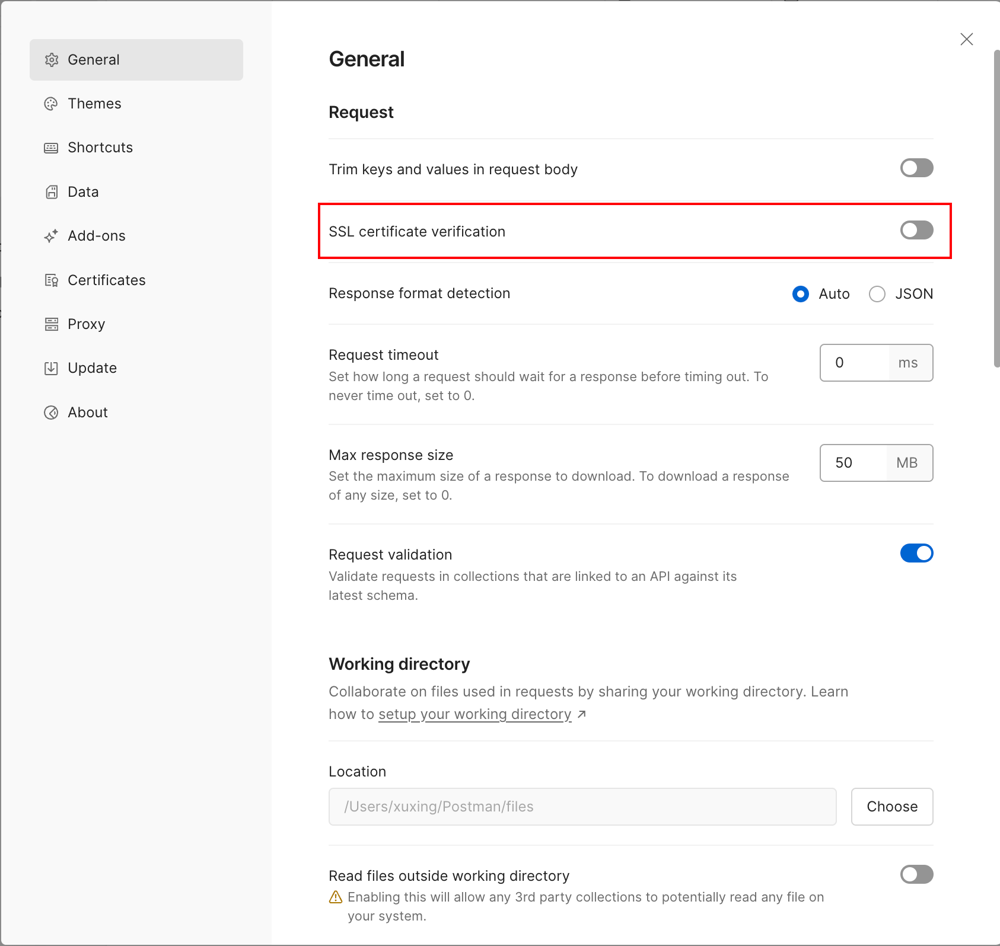
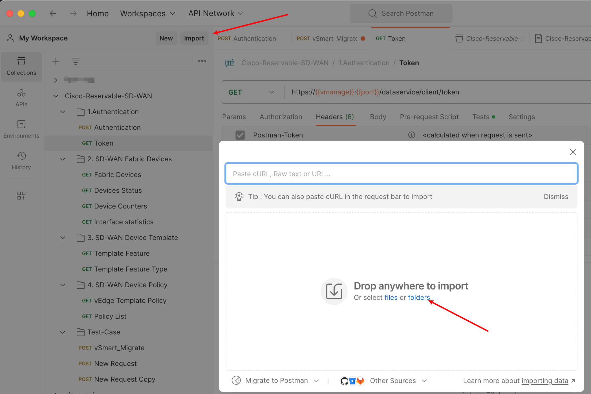
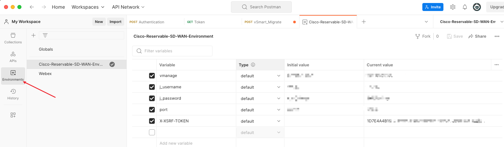
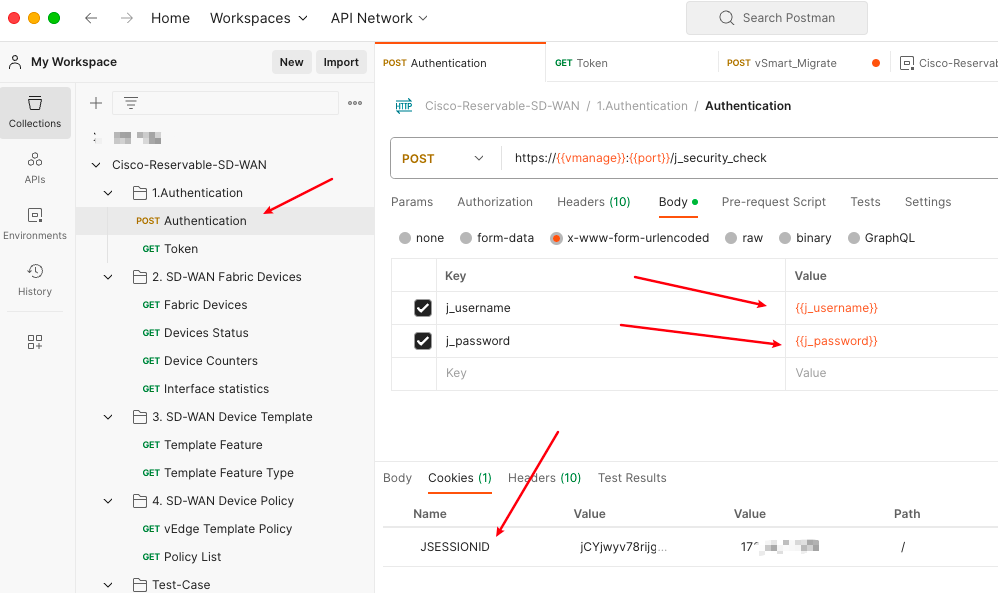
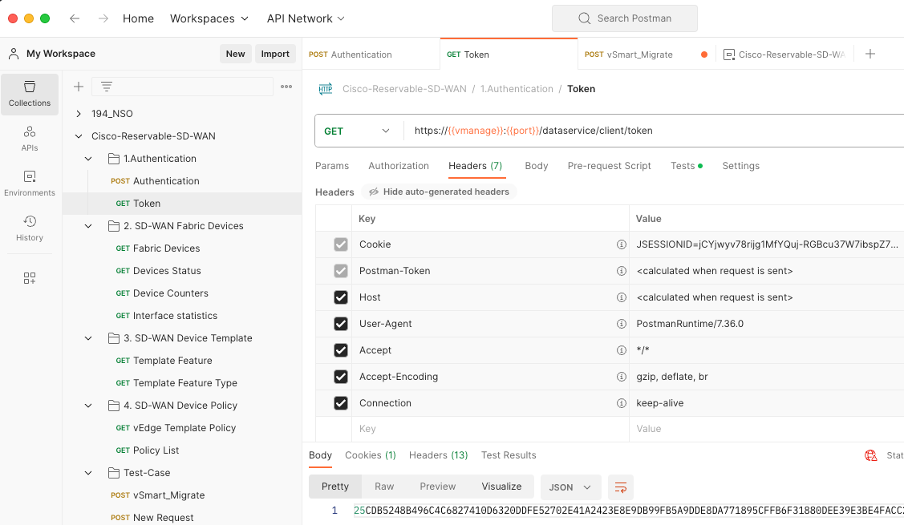
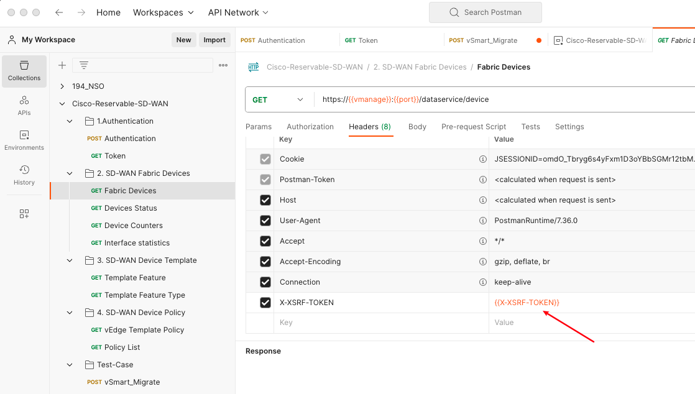

Cisco SDWAN vManage 提供了一个 REST API 接口， 通过这个接口我们可以之间 get 很多设备信息，或者执行一些配置的下发。

API 相关的文档 [Cisco SD-WAN vManage API](https://developer.cisco.com/docs/sdwan/)

使用浏览器我们可以进行简单的 Get API 的操作， 但是如果涉及一些复杂的操作，例如 filer 一段时间，或者需要执行一些 Post API， 浏览器就不太方便实现。

这里我们可以使用 API 专业的调试软件`Postman`.

## Postman configuration

在 Postman 中先关闭 SSL certificate verification。



Github 上有个 Getting-started-with-Cisco-SD-WAN-REST-APIs 仓库, 里面包含了一些帮我们设定好的 API，我们可以之间 clone 下来导入到 Postman 中去使用:

```
git clone https://github.com/CiscoDevNet/Getting-started-with-Cisco-SD-WAN-REST-APIs.git

├── Postman
│   ├── Cisco-Reservable-SD-WAN-Env.postman_environment.json
│   └── Cisco-Reservable-SD-WAN.postman_collection.json
```

在 Postman 文件夹下会有两个文件夹，一个包含你的 vManage 的 username 和 password 的相关设定，另一个包含一些常见的 API。我们都将他导入到 Postman 中，如下：



在 Environments 菜单中修改 vMange 相关参数，其中`X-XSPF-TOKEN`为后续自动生成的，可以不需要填写。



## API Authentication

使用 API 进行交互的第一步是认证， 在刚刚导入 postman 的 API collection 中有一项为 Authentication 的 Post 调用， 执行该 Post 调用后，vManage 会生成一个 JSESSIONID 并返回给我们.



第二步我们可以使用 get token 的方法， 将 `JSESSONID` 传递给 vManage， vManage 则会返回一串 token，这个 token 会自动填充在 Environment 设定的参数 `X-XSRF-TOKEN`。（如果无法自动填充，请自行复制修改 environment）



后续我们执行所有的 API 操作，都需要使用该 token 进行验证,如果自己要自定义一些 API 操作， 请自行在 Header 中添加这个`X-XSRF-TOKEN`变量。


