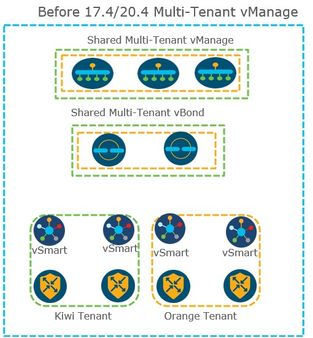
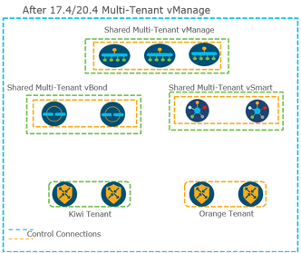
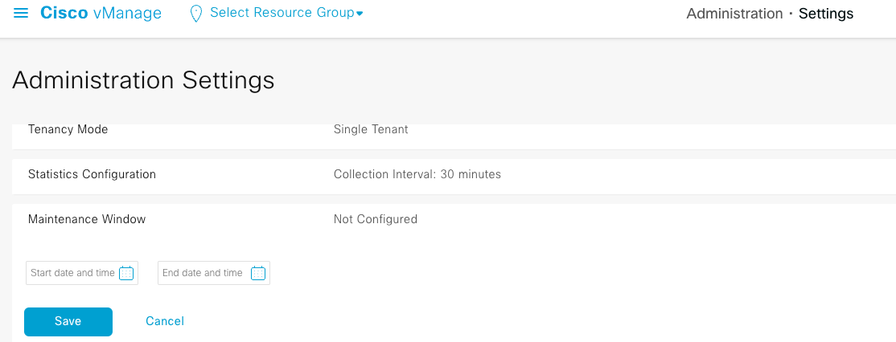
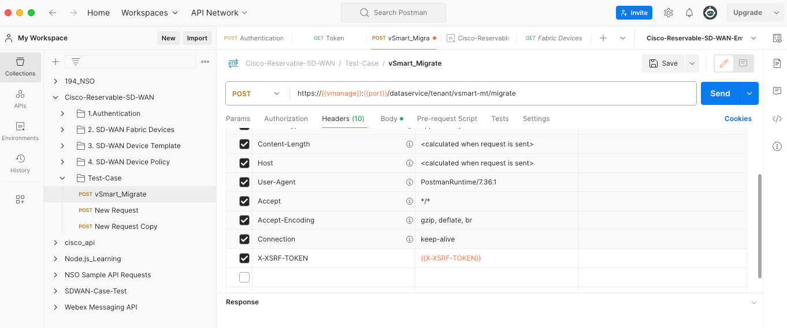
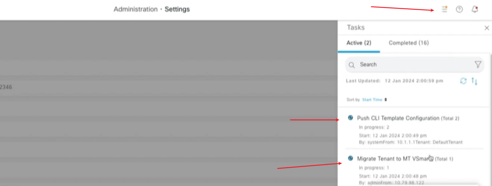

## Background

在 20.4.x 之前的多租户的架构如下,每个租户拥有独立的 vSmart，所以在 20.4.x 之前 vSmart 只在各个租户的 GUI 界面上去显示

在 20.4.x 之后，架构发生了变化，vSmart 变成在多个租户之间共享的存在。

由于架构发生了变化，MT 环境从 20.4.x 之前往高版本去升级的时候步骤会有略微的变化。

## Upgrade Steps

我的测试环境为 Single vManage + vBond + 2 Tenancy（every Tenancy has 1 vSmart）20.3.7.1

由于是 Single vMange 所以升级会略微简单。

### vManage upgrade to 20.6.x

先进行 vManage 的升级，参考以下文章；

- 上传升级 Image
- Upgrade/Install，进行一个 pre-insall
- Activate New Version，激活新版本，此时 vMange 会重启
- Set Default Version

> [vManage Upgrade](https://www.cisco.com/c/zh_cn/support/docs/wan/dpt/220424-upgrade-sd-wan-controllers-with-the-use.html#toc-hId--1724275443)

### vBond upgrade to 20.6.x

vbond 升级和 vMange 升级类似。

### Add New two 20.6.x vSmart

添加 2 个 20.6.x 的 vSmart，如果 Tenancy 比较多，那安装 Tenancy 的数量去选择在这一步添加多少个 vSmart。

添加至 vManage 后进行证书的安装， 并下发 vSmart 模版.


**Warning!** 注意这个地方一定需要下发 vSmart 模版，无论是 CLI 模版 or 标准的模版，否则你将会在下一步 API 操作中遇到报错`Found 0 vSmarts in vManage node, Need atleast 2 vSmarts in vManaged mode and In Sync to onboard a tenant`


### Enable maintenance window on Cisco vManage


**Warning!** 这个地方的时间是 GUI 页面登录 PC 的时间，不是 vMange host 所在地方的时间。


这个步骤也无法省略，否则在 API 下发步骤会遇到报错`vManage is not in maintenance node, Cannot migrate tenants to MT vSmarts at the time`.

### Use API to Migrate

使用 API 需要先解决认证问题， 这个请参考之前的一篇文章[Cisco SDWAN API](https://imxing.info/sdwan/cisco-sdwan-api/)

新建一个 API 如下:

API 执行成功后回回复一个 task-id：

### Check Task from vManage GUI

这个时候登录到 vManage 将会看到一些 task run 在后台，等待它自动完成。

当所有的 task 都完成后， 旧的 20.3.7.1 vSmart 将会被移除，新加入的 20.6.x vSmart 将和所有的 vEdge/cEdge 建立控制连接。
